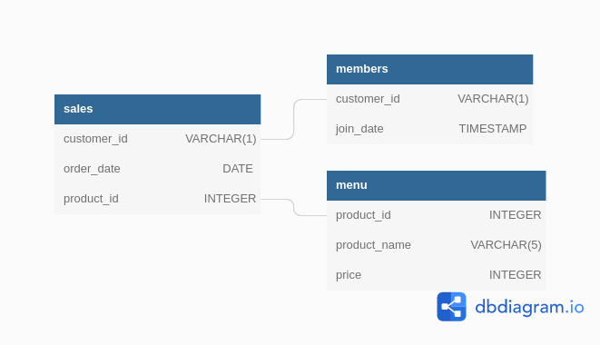

# :ramen: Case Study #1 - Danny's Diner <!-- omit in toc -->


## Table of Contents <!-- omit in toc -->

- [Introduction](#introduction)
- [Problem Statement](#problem-statement)
- [Data Description](#data-description)
- [Case Study Questions](#case-study-questions)
  - [1. What is the total amount each customer spent at the restaurant?](#1-what-is-the-total-amount-each-customer-spent-at-the-restaurant)
  - [2. How many days has each customer visited the restaurant?](#2-how-many-days-has-each-customer-visited-the-restaurant)
  - [3. What was the first item from the menu purchased by each customer?](#3-what-was-the-first-item-from-the-menu-purchased-by-each-customer)
  - [4. What is the most purchased item on the menu and how many times was it purchased by all customers?](#4-what-is-the-most-purchased-item-on-the-menu-and-how-many-times-was-it-purchased-by-all-customers)
  - [5. Which item was the most popular for each customer?](#5-which-item-was-the-most-popular-for-each-customer)
  - [6. Which item was purchased first by the customer after they became a member?](#6-which-item-was-purchased-first-by-the-customer-after-they-became-a-member)
  - [7. Which item was purchased just before the customer became a member?](#7-which-item-was-purchased-just-before-the-customer-became-a-member)
  - [8. What is the total items and amount spent for each member before they became a member?](#8-what-is-the-total-items-and-amount-spent-for-each-member-before-they-became-a-member)
  - [9. If each $1 spent equates to 10 points and sushi has a 2x points multiplier - how many points would each customer have?](#9-if-each-1-spent-equates-to-10-points-and-sushi-has-a-2x-points-multiplier---how-many-points-would-each-customer-have)
  - [10. In the first week after a customer joins the program (including their join date) they earn 2x points on all items, not just sushi - how many points do customer A and B have at the end of January?](#10-in-the-first-week-after-a-customer-joins-the-program-including-their-join-date-they-earn-2x-points-on-all-items-not-just-sushi---how-many-points-do-customer-a-and-b-have-at-the-end-of-january)
- [Bonus Questions](#bonus-questions)
  - [Join All The Things](#join-all-the-things)
  - [Rank All The Things](#rank-all-the-things)
- [Additional Info](#additional-info)

## Introduction

Danny seriously loves Japanese food so in the beginning of 2021, he decides to embark upon a risky venture and opens up a cute little restaurant that sells his 3 favourite foods: sushi, curry and ramen.

Danny’s Diner is in need of your assistance to help the restaurant stay afloat - the restaurant has captured some very basic data from their few months of operation but have no idea how to use their data to help them run the business.

## Problem Statement

Danny wants to use the data to answer a few simple questions about his customers, especially about their visiting patterns, how much money they’ve spent and also which menu items are their favourite. Having this deeper connection with his customers will help him deliver a better and more personalised experience for his loyal customers.

He plans on using these insights to help him decide whether he should expand the existing customer loyalty program - additionally he needs help to generate some basic datasets so his team can easily inspect the data without needing to use SQL.

## Data Description

There are three main tables used in this analysis. These are:

1. The `sales` table captures all `customer_id` level purchases with an corresponding `order_date` and `product_id` information for when and what menu items were ordered.
2. The `menu` table maps the `product_id` to the actual `product_name` and `price` of each menu item.
3. The final members table captures the join_date when a customer_id joined the beta version of the Danny’s Diner loyalty program.

The Entity Relationship Diagram for the dataset is given below:



---

## Case Study Questions

### 1. What is the total amount each customer spent at the restaurant?

**The query:**

```sql
SELECT customer_id,
       Concat('$', SUM(price)) AS total_spent
FROM   sales AS s
       inner join menu AS m
               ON s.product_id = m.product_id
GROUP  BY customer_id
ORDER  BY customer_id;
```

**The Result Set:**

|customer_id|total_spent|
|--|--|
|A|$76|
|B|$74|
|C|$36|

### 2. How many days has each customer visited the restaurant?

**The query:**

```sql
SELECT customer_id,
       Count(DISTINCT order_date) AS number_of_visits
FROM   sales AS s
       inner join menu AS m
               ON s.product_id = m.product_id
GROUP  BY customer_id
ORDER  BY customer_id; 
```

**The Result Set:**

|customer_id|number_of_visits|
|--|--|
|A|4|
|B|6|
|C|2|

### 3. What was the first item from the menu purchased by each customer?

*The order_date column is of date type, so it's not possible to break ties within the same day.*

**The query:**

```sql
WITH date_ranked_purchase
     AS (SELECT customer_id,
                product_name,
                Rank()
                  over(
                    PARTITION BY customer_id
                    ORDER BY order_date) AS date_rank
         FROM   sales AS s
                inner join menu AS m
                        ON s.product_id = m.product_id
         ORDER  BY order_date)

SELECT customer_id,
       String_agg(DISTINCT product_name, ', ') AS first_dishes
FROM   date_ranked_purchase
WHERE  date_rank = 1
GROUP  BY customer_id
ORDER  BY customer_id; 
```

**The Result Set:**

|customer_id|first_dishes|
|--|--|
|A|curry, sushi|
|B|curry|
|C|ramen|

### 4. What is the most purchased item on the menu and how many times was it purchased by all customers?

**The query:**

```sql
SELECT product_name AS most_purchased_item,
       times_purchased
FROM   (SELECT product_id,
               Count(*)                    AS times_purchased,
               Rank()
                 over(
                   ORDER BY Count(*) DESC) AS frequency_rank
        FROM   sales
        GROUP  BY product_id) AS sub
       inner join menu AS m
               ON sub.product_id = m.product_id
WHERE  frequency_rank = 1; 
```

**The Result Set:**

|most_purchased_item|times_purchased|
|--|--|
|ramen|8|

### 5. Which item was the most popular for each customer?

**The query:**

```sql
SELECT customer_id,
       String_agg(product_name, ', ') AS most_popular_items,
       times_ordered
FROM   (SELECT customer_id,
               product_id,
               Count(*)                    AS times_ordered,
               Rank()
                 over(
                   PARTITION BY customer_id
                   ORDER BY Count(*) DESC) AS count_rank
        FROM   sales
        GROUP  BY customer_id,
                  product_id) AS s
       inner join menu AS m
               ON s.product_id = m.product_id
WHERE  count_rank = 1
GROUP  BY customer_id,
          times_ordered
ORDER  BY customer_id; 
```

**The Result Set:**

|customer_id|most_popular_items|times_ordered|
|--|--|--|
|A|ramen|3|
|B|sushi, curry, ramen|2|
|C|ramen|3|

### 6. Which item was purchased first by the customer after they became a member?

*It was assumed that on the day that a customer becomes a member, he/she becomes a member before making any purchase.*

**The query:**

```sql
WITH first_post_member_purchase
     AS (SELECT customer_id,
                product_id
         FROM   (SELECT s.customer_id,
                        product_id,
                        Rank()
                          over(
                            PARTITION BY s.customer_id
                            ORDER BY order_date) AS date_rank
                 FROM   sales AS s
                        inner join members AS m
                                ON s.customer_id = m.customer_id
                 WHERE  order_date >= join_date) AS subquery
         WHERE  date_rank = 1)

SELECT customer_id,
       String_agg(product_name, ', ') AS first_item_purchased
FROM   first_post_member_purchase AS fpmp
       inner join menu AS m
               ON fpmp.product_id = m.product_id
GROUP  BY customer_id
ORDER  BY customer_id; 
```

**The Result Set:**

|customer_id|first_item_purchased|
|--|--|
|A|curry|
|B|sushi|

### 7. Which item was purchased just before the customer became a member?

*It was assumed that on the day that a customer becomes a member, he/she becomes a member before making any purchase.*

**The query:**

```sql
WITH last_pre_member_purchase
     AS (SELECT customer_id,
                product_id
         FROM   (SELECT s.customer_id,
                        product_id,
                        Rank()
                          over(
                            PARTITION BY s.customer_id
                            ORDER BY order_date DESC) AS date_rank
                 FROM   sales AS s
                        inner join members AS m
                                ON s.customer_id = m.customer_id
                 WHERE  order_date < join_date) AS subquery
         WHERE  date_rank = 1)

SELECT customer_id,
       String_agg(product_name, ', ') AS last_pre_member_purchase
FROM   last_pre_member_purchase AS lpmp
       inner join menu AS m
               ON lpmp.product_id = m.product_id
GROUP  BY customer_id
ORDER  BY customer_id; 
```

**The Result Set:**

|customer_id|last_pre_member_purchase|
|--|--|
|A|sushi, curry|
|B|sushi|

### 8. What is the total items and amount spent for each member before they became a member?

*It was assumed that on the day that a customer becomes a member, he/she becomes a member before making any purchase.*

**The query:**

```sql
WITH pre_member_purchase
     AS (SELECT s.customer_id,
                product_id
         FROM   sales AS s
                inner join members AS m
                        ON s.customer_id = m.customer_id
         WHERE  order_date < join_date)

SELECT customer_id,
       Count(*)                AS num_items_bought,
       Concat('$', SUM(price)) AS total_spent
FROM   pre_member_purchase AS pmp
       inner join menu AS m
               ON pmp.product_id = m.product_id
GROUP  BY customer_id
ORDER  BY customer_id; 
```

**The Result Set:**

|customer_id|num_items_bought|total_spent|
|--|--|--|
|A|2|$25|
|B|3|$40|

### 9. If each $1 spent equates to 10 points and sushi has a 2x points multiplier - how many points would each customer have?

For all customers

**The query:**

```sql
WITH points_table
     AS (SELECT product_id,
                CASE
                  WHEN product_name = 'sushi' THEN 20 * price
                  ELSE 10 * price
                END AS points
         FROM   menu)

SELECT customer_id,
       SUM(points) AS total_points
FROM   sales AS s
       inner join points_table AS p
               ON s.product_id = p.product_id
GROUP  BY customer_id
ORDER  BY customer_id; 
```

**The Result Set:**

|customer_id|total_points|
|--|--|
|A|860|
|B|940|
|C|360|

Only for members after they became members

**The query:**

```sql
WITH points_table
     AS (SELECT product_id,
                CASE
                  WHEN product_name = 'sushi' THEN 20 * price
                  ELSE 10 * price
                END AS points
         FROM   menu)

SELECT s.customer_id,
       SUM(points) AS total_points
FROM   sales AS s
       join points_table AS p
         ON s.product_id = p.product_id
       inner join members AS m
               ON s.customer_id = m.customer_id
WHERE  order_date >= join_date
GROUP  BY s.customer_id;
```

**The Result Set:**

|customer_id|total_points|
|--|--|
|A|510|
|B|440|

### 10. In the first week after a customer joins the program (including their join date) they earn 2x points on all items, not just sushi - how many points do customer A and B have at the end of January?

For members counting points from both before and after becoming member

**The query:**

```sql
SELECT s.customer_id,
       SUM(CASE
             WHEN order_date BETWEEN join_date AND ( join_date + Cast('1 week'
                                                     AS
                                                     INTERVAL)
                                                   ) THEN 20 * price
             WHEN product_name = 'sushi' THEN 20 * price
             ELSE 10 * price
           END) AS total_points
FROM   sales AS s
       inner join members AS mem
               ON s.customer_id = mem.customer_id
       inner join menu AS mnu
               ON s.product_id = mnu.product_id
WHERE  order_date <= '2021-01-31'
GROUP  BY s.customer_id
ORDER  BY s.customer_id; 
```

**The Result Set:**

|customer_id|total_points|
|--|--|
|A|1370|
|B|940|

For members counting points only after becoming member

**The query:**

```sql
SELECT s.customer_id,
       SUM(CASE
             WHEN order_date BETWEEN join_date AND ( join_date + Cast('1 week'
                                                     AS
                                                     INTERVAL)
                                                   ) THEN 20 * price
             WHEN product_name = 'sushi' THEN 20 * price
             ELSE price * 10
           END) AS total_points
FROM   sales AS s
       inner join members AS mem
               ON s.customer_id = mem.customer_id
       inner join menu AS mnu
               ON s.product_id = mnu.product_id
WHERE  order_date <= '2021-01-31'
       AND order_date >= join_date
GROUP  BY s.customer_id
ORDER  BY s.customer_id; 
```

**The Result Set:**

|customer_id|total_points|
|--|--|
|A|1020|
|B|440|

---

## Bonus Questions

### Join All The Things

**The query:**

```sql
SELECT s.customer_id,
       order_date,
       product_name,
       price,
       CASE
         WHEN order_date >= join_date THEN 'Y'
         ELSE 'N'
       END AS member
FROM   sales AS s
       left join members AS mem
              ON s.customer_id = mem.customer_id
       inner join menu AS mnu
               ON s.product_id = mnu.product_id
ORDER  BY s.customer_id,
          order_date; 
```

**The Result Set:**

|customer_id|order_date|product_name|price|member|
|--|--|--|--|--|
|A|2021-01-01|sushi|10|N|
|A|2021-01-01|curry|15|N|
|A|2021-01-07|curry|15|Y|
|A|2021-01-10|ramen|12|Y|
|A|2021-01-11|ramen|12|Y|
|A|2021-01-11|ramen|12|Y|
|B|2021-01-01|curry|15|N|
|B|2021-01-02|curry|15|N|
|B|2021-01-04|sushi|10|N|
|B|2021-01-11|sushi|10|Y|
|B|2021-01-16|ramen|12|Y|
|B|2021-02-01|ramen|12|Y|
|C|2021-01-01|ramen|12|N|
|C|2021-01-01|ramen|12|N|
|C|2021-01-07|ramen|12|N|

### Rank All The Things

**The query:**

```sql
SELECT s.customer_id,
       order_date,
       product_name,
       price,
       CASE
         WHEN order_date >= join_date THEN 'Y'
         ELSE 'N'
       END AS member,
       CASE
         WHEN order_date >= join_date THEN Rank()
         over (
           PARTITION BY s.customer_id
           ORDER BY order_date >= join_date DESC,
         order_date )
       END AS ranking
FROM   sales AS s
       left join members AS mem
              ON s.customer_id = mem.customer_id
       inner join menu AS mnu
               ON s.product_id = mnu.product_id
ORDER  BY s.customer_id,
          order_date; 
```

**The Result Set:**

|customer_id|order_date|product_name|price|member|ranking|
|--|--|--|--|--|--|
|A|2021-01-01|sushi|10|N||
|A|2021-01-01|curry|15|N||
|A|2021-01-07|curry|15|Y|1|
|A|2021-01-10|ramen|12|Y|2|
|A|2021-01-11|ramen|12|Y|3|
|A|2021-01-11|ramen|12|Y|3|
|B|2021-01-01|curry|15|N||
|B|2021-01-02|curry|15|N||
|B|2021-01-04|sushi|10|N||
|B|2021-01-11|sushi|10|Y|1|
|B|2021-01-16|ramen|12|Y|2|
|B|2021-02-01|ramen|12|Y|3|
|C|2021-01-01|ramen|12|N||
|C|2021-01-01|ramen|12|N||
|C|2021-01-07|ramen|12|N||

---

## Additional Info

The steps on setting up the schema and tables required for the analysis can be found in the `Queries.sql` file in the current directory. The file also includes steps for executing the queries.

The details of the #8weeksqlchallenge can be found [here](https://8weeksqlchallenge.com/), and the details of this case study can be found [here](https://8weeksqlchallenge.com/case-study-1/).
